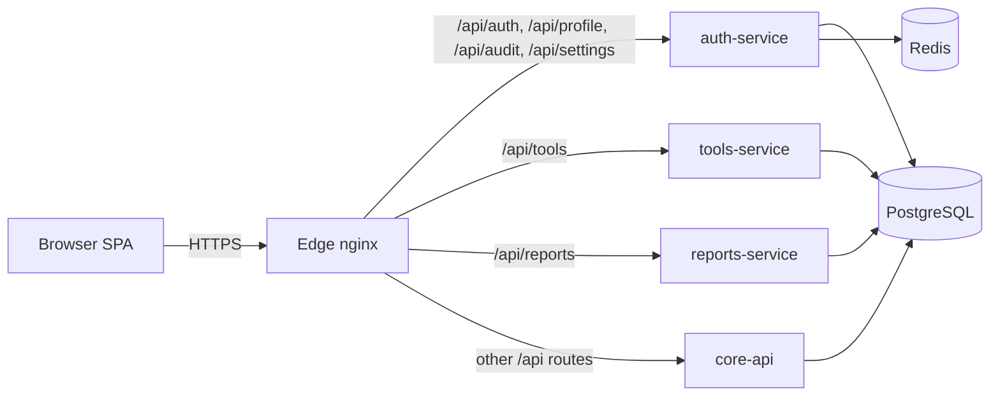

# Security-First Fullstack Template

A reusable fullstack template for platforms with secure defaults and clear service boundaries.

This template provides:
- React SPA frontend behind nginx edge
- Node/Express backend split into domain services (`auth-service`, `core-api`, `tools-service`, `reports-service`)
- PostgreSQL persistence with startup migrations
- Redis-backed distributed rate limiting
- JWT + rotating refresh sessions with replay/reuse protections
- Optional DPoP token binding with nonce and replay enforcement
- Optional TOTP MFA with enrollment and challenge flows
- RBAC, audit logging, and health endpoints
- TLS 1.3-only edge configuration with strong ciphersuites

## 1. Template Goals

Use this template when you need to build a production-grade HR platform quickly while keeping security controls close to the defaults.

Primary goals:
- Strong authentication and session lifecycle controls
- Route-level authorization using backend-enforced RBAC
- Isolation of concerns through service boundaries
- Observable runtime behavior (health + audit)
- A practical extension path for future HR domain modules

## 2. Architecture

### 2.1 Topology



### 2.2 Service ownership

- `auth-service`
  - Authentication, refresh rotation, logout
  - DPoP validation and nonce challenge flow
  - MFA enrollment and challenge completion
  - Profile APIs, settings read APIs, audit read APIs
  - Force logout and token revocation actions
- `core-api`
  - Core platform APIs and aggregate component health scaffold
- `tools-service`
  - Utility/tooling endpoints scaffold
- `reports-service`
  - Reporting endpoints scaffold
- `edge (nginx)`
  - TLS termination and route dispatch

### 2.3 Route contract

- `/api/auth/*`, `/api/profile/*`, `/api/audit/*`, `/api/settings/*` -> `auth-service`
- `/api/tools/*` -> `tools-service`
- `/api/reports/*` -> `reports-service`
- Remaining `/api/*` -> `core-api`
- `/` -> React client

## 3. Stack and Runtime Components

- Frontend: React + Vite, static content served by nginx
- Backend: Node.js 20 + Express + TypeScript
- Database: PostgreSQL 16
- Cache/rate-limits: Redis 7
- Edge proxy: nginx 1.27
- Container orchestration: Docker Compose

## 4. Repository Layout

```text
.
├─ client/
│  ├─ src/
│  │  ├─ App.tsx
│  │  └─ lib/dpop.ts
│  ├─ Dockerfile
│  └─ nginx.conf
├─ deploy/
│  ├─ certs/
│  └─ nginx.conf
├─ server/
│  ├─ src/
│  │  ├─ auth-service.ts
│  │  ├─ core-api.ts
│  │  ├─ tools-service.ts
│  │  ├─ reports-service.ts
│  │  ├─ db.ts
│  │  ├─ middleware/
│  │  ├─ routes/
│  │  ├─ services/
│  │  └─ utils/
│  ├─ Dockerfile
│  └─ package.json
├─ docker-compose.yml
├─ .env.example
└─ README.md
```

## 5. Prerequisites

- Docker Desktop (with Compose v2)
- OpenSSL (for local certificate generation)
- Optional for local non-container development:
  - Node.js 20+
  - npm

## 6. Quick Start (Docker)

### 6.1 Configure env

```sh
cp .env.example .env
```

For local dev, defaults work. For any shared/dev server, replace at minimum:
- `JWT_SECRET`
- `PSS_MASTER_KEY`
- `PGPASSWORD`

### 6.2 Generate TLS cert (local)

```sh
mkdir -p deploy/certs
openssl req -x509 -newkey rsa:4096 -sha256 -days 365 -nodes \
  -keyout deploy/certs/tls.key \
  -out deploy/certs/tls.crt \
  -subj "/CN=localhost"
```

### 6.3 Build and run

```sh
docker compose up --build
```

### 6.4 Access

- App: `https://localhost`
- API base via edge: `https://localhost/api`
- HTTP (`http://localhost`) redirects to HTTPS

### 6.5 Dev seed user (non-production only)

Created automatically when `NODE_ENV != production`:
- Username: `admin`
- Password: `ChangeMe!123`
- Role: `hr_admin`

## 7. Local Development Without Docker (Optional)

You can run services directly, but you still need PostgreSQL and Redis available.

From `server/`:

```sh
npm install
npm run build
npm run dev:auth
npm run dev:core
npm run dev:tools
npm run dev:reports
```

From `client/`:

```sh
npm install
npm run dev
```

Notes:
- Set `VITE_API_BASE` to your API origin if not using default `/api`.
- Cookie and DPoP flows are simplest when requests originate from HTTPS and same site through nginx.

## 8. Environment Variables

Defined in `.env.example`.

### 8.1 Critical security secrets

- `JWT_SECRET`: HMAC signing key for access tokens
- `PSS_MASTER_KEY`: master key material for AES-GCM encryption of secrets-at-rest

### 8.2 Database

- `PGHOST`, `PGPORT`, `PGUSER`, `PGPASSWORD`, `PGDATABASE`

### 8.3 Redis/rate limiting

- `REDIS_ENABLED` (`true`/`false`)
- `REDIS_HOST`, `REDIS_PORT`, `REDIS_PASSWORD`, `REDIS_DB`
- `REDIS_KEY_PREFIX`

### 8.4 Auth and session policy

- `JWT_TTL_SECONDS`
- `REFRESH_TOKEN_TTL_SECONDS`
- `JWT_REFRESH_WINDOW_SECONDS` (currently configuration exposure; not yet actively enforced in refresh logic)
- `AUTH_MAX_FAILED_LOGINS`
- `AUTH_AUTO_UNLOCK_MINUTES`

### 8.5 MFA

- `MFA_TOTP_ISSUER`
- `MFA_TOTP_PERIOD_SECONDS`
- `MFA_ENROLL_TTL_SECONDS`
- `MFA_CHALLENGE_TTL_SECONDS`

### 8.6 DPoP

- `DPOP_NONCE_TTL_SECONDS`
- `DPOP_PROOF_MAX_AGE_SECONDS`

### 8.7 Ports

- `AUTH_SERVICE_PORT` (default `3001`)
- `CORE_API_PORT` (default `3002`)
- `TOOLS_SERVICE_PORT` (default `3004`)
- `REPORTS_SERVICE_PORT` (default `3005`)

## 9. Docker Compose Model

### 9.1 Networks

- `edge`: public ingress-facing network for nginx and app exposure
- `backend` (`internal: true`): private network for service-to-service traffic

### 9.2 Volumes

- `pg_data`: persistent PostgreSQL data

### 9.3 Startup dependencies

- `auth-service` waits for `postgres` and `redis` health checks
- `core-api`, `tools-service`, `reports-service` wait for `postgres`
- `edge` depends on app/service containers

## 10. TLS and Edge Security

Edge config (`deploy/nginx.conf`) enforces:
- TLS 1.3 only (`ssl_protocols TLSv1.3;`)
- Ciphersuite allowlist:
  - `TLS_AES_256_GCM_SHA384`
  - `TLS_CHACHA20_POLY1305_SHA256`
  - `TLS_AES_128_GCM_SHA256`
- HSTS enabled with preload directive
- `X-Content-Type-Options: nosniff`
- `X-Frame-Options: DENY`
- `Referrer-Policy: strict-origin-when-cross-origin`
- Session tickets disabled
- HTTP to HTTPS redirect

## 11. Express Service Baseline

Each service boots through shared helpers and gets:
- `helmet` hardening
- CORS with credentials enabled
- JSON body parsing with size limits
- Request logging (`morgan`)
- Standard `/api/health`
- Common not-found and error handlers
- Graceful shutdown on `SIGTERM`/`SIGINT`

Startup path:
1. Run DB migrations (`migrate()`)
2. Initialize app and routes
3. Start listener
4. On shutdown, close PostgreSQL and Redis connections

## 12. Database and Migration Behavior

Migrations are in `server/src/db.ts` and are designed to be idempotent.

Key points:
- Uses `CREATE TABLE IF NOT EXISTS`, additive `ALTER TABLE`, and safe `UPDATE` backfills
- Uses PostgreSQL advisory lock (`pg_advisory_lock`) to prevent concurrent migration races
- Seeds roles on startup
- Seeds a non-production admin user

### 12.1 Core tables

- `roles`
- `users`
- `auth_sessions`
- `auth_mfa_challenges`
- `user_profiles`
- `user_preferences`
- `audit_logs`
- `dpop_replay_cache`
- `dpop_nonces`

### 12.2 RBAC seed roles

- `hr_admin`
- `manager`
- `employee`

## 13. Authentication and Session Model

### 13.1 Access token

JWT (`HS256`) claims include:
- `sub`, `username`, `role`, `sid`, `tv`, `jti`, `iat`, `exp`
- Optional `cnf.jkt` for DPoP-bound sessions

### 13.2 Refresh token

- Stored server-side as SHA-256 hash in `auth_sessions`
- Client receives refresh token in `HttpOnly` cookie (`refresh_token`)
- Token rotates on every refresh

### 13.3 Cookie/CSRF model

- Refresh cookie:
  - `HttpOnly`, `Secure`, `SameSite=Strict`, path `/api/auth`
- CSRF cookie (`csrf_token`):
  - `Secure`, `SameSite=Strict`, JS-readable
- Refresh endpoint requires matching `X-CSRF-Token` header (double-submit pattern)

### 13.4 Refresh token reuse detection

If refresh token hash does not match active server record for same `sid`:
- Session is treated as replay/reuse
- Entire session family is revoked
- User `token_version` increments (force invalidation of active access JWTs)
- Refresh fails with `401`

### 13.5 Account lockout and disable controls

- Permanent status: `is_active`
- Temporary lock: `failed_login_attempts` + `login_locked_until`
- Failed password attempts increment counters and can trigger lock
- Successful login resets counters

### 13.6 Forced logout

Admin route can revoke all sessions for a user and increment token version.

## 14. DPoP Enforcement

This template supports both bearer and DPoP-bound sessions.

Behavior:
- If `dpop_jwk` is provided at login/MFA completion:
  - Session stores `dpop_jkt` thumbprint
  - Access token includes `cnf.jkt`
  - Protected calls must use:
    - `Authorization: DPoP <access_token>`
    - `DPoP: <proof_jwt>`
- If session is not DPoP-bound:
  - Standard `Authorization: Bearer <access_token>` accepted

Validation checks for bound sessions:
- Proof signature and JWK integrity
- `typ = dpop+jwt`
- Allowed asymmetric algorithms only
- `htm` and normalized `htu` match request
- `ath` matches access token hash (for access-token protected routes)
- Nonce required and one-time consumed
- `jti` replay detection in shared DB cache

If nonce is missing/invalid, server responds with:
- `401`
- `WWW-Authenticate: DPoP error="use_dpop_nonce"`
- `DPoP-Nonce: <nonce>`

## 15. MFA (TOTP)

### 15.1 Enrollment

1. `POST /api/auth/mfa/enroll/start`
2. Server returns:
   - `otp_auth_uri`
   - `qr_data_url`
   - masked `manual_key`
   - `expires_at`
3. `POST /api/auth/mfa/enroll/verify` with first TOTP code

### 15.2 Login with MFA

1. `POST /api/auth/login` may return `mfa_required` + `challenge_id`
2. `POST /api/auth/mfa/complete` validates code and issues auth cookies/tokens

Security details:
- MFA secrets encrypted at rest (AES-256-GCM via `PSS_MASTER_KEY`)
- Enrollment and challenge TTL enforced
- Challenge one-time use (`consumed_at`)
- Last used timestep tracked to reduce code replay

## 16. RBAC Model

- `users.role` references `roles.role_key`
- Protected routes use:
  - `authenticateAccessToken`
  - `requirePermission("...")`
- Permissions are enforced server-side on every protected route

Current permission examples:
- `audit:read`
- `settings:read`, `settings:write`
- `users:manage`
- `sessions:revoke`
- `profile:read`, `profile:write`
- `reports:read`
- `tools:use`

## 17. Rate Limiting

Redis-backed per-route rate limiters are applied to sensitive auth endpoints:
- Login by IP and account key
- Refresh by IP
- MFA completion and verification by IP

Headers exposed:
- `X-RateLimit-Limit`
- `X-RateLimit-Remaining`
- `Retry-After` (on 429)

If Redis is unavailable, middleware fails open and logs an error.

## 18. Audit Logging

Template logs key auth and admin actions into `audit_logs`.

Captured fields include:
- Actor identity (`user_id`, `username`, `role`)
- Action and resource
- HTTP method/path
- Status code
- Source IP and user-agent
- JSON metadata
- Timestamp

Examples:
- Login success/failure
- Refresh success/failure/reuse detection
- Logout
- Force logout operations

## 19. Health Endpoints

- All services expose `/api/health`
- `core-api` also exposes `/api/components` (DB check + service placeholders)

Use these for:
- Container health checks
- Smoke tests after deployment
- Admin status dashboards

## 20. API Endpoint Inventory

### 20.1 Auth and identity

- `POST /api/auth/login`
- `POST /api/auth/refresh`
- `POST /api/auth/logout`
- `POST /api/auth/users/:userId/force-logout`
- `POST /api/auth/mfa/complete`
- `POST /api/auth/mfa/enroll/start`
- `POST /api/auth/mfa/enroll/verify`

### 20.2 Profile

- `GET /api/profile/me`
- `PATCH /api/profile/me`

### 20.3 Audit and settings

- `GET /api/audit/logs`
- `GET /api/settings/security`
- `PATCH /api/settings/security` (scaffold, returns not implemented)

### 20.4 Tools and reports

- `GET /api/tools/ping`
- `GET /api/reports/summary`
- `POST /api/reports/export`

### 20.5 Core

- `GET /api/components`

## 21. Frontend DPoP Helper

`client/src/lib/dpop.ts` provides:
- DPoP keypair generation/export
- Payload helper `withDpopJwk(...)`
- `DpopClient.fetch(...)` that:
  - Adds DPoP proof header
  - Adds `Authorization: DPoP ...` when access token is provided
  - Automatically attaches `X-CSRF-Token` for non-safe methods
  - Sends credentials by default (`include`)
  - Retries once on nonce challenge

## 22. Build, Validation, and Useful Commands

### 22.1 Build all containers

```sh
docker compose build
```

### 22.2 Start detached

```sh
docker compose up -d
```

### 22.3 Tail logs

```sh
docker compose logs -f edge auth-service core-api tools-service reports-service postgres redis
```

### 22.4 Stop stack

```sh
docker compose down
```

### 22.5 Stop and remove DB volume (destructive)

```sh
docker compose down -v
```

## 23. Extension Guide for Future Development

### 23.1 Add a new domain service

1. Create `server/src/<service>.ts` entrypoint
2. Add service route module(s)
3. Register service in `docker-compose.yml`
4. Add nginx upstream + route mapping in `deploy/nginx.conf`
5. Add health checks and audit hooks
6. Update this README endpoint inventory

### 23.2 Add a new protected endpoint

1. Define zod input schema
2. Add `authenticateAccessToken` middleware
3. Add `requirePermission("...")`
4. Implement DB queries with parameterized SQL only
5. Add audit event write for mutating operations
6. Update role seeds if new permission is introduced

### 23.3 Add a new permission

1. Add permission string to `roles` seed in `server/src/db.ts`
2. Add enforcement middleware on route(s)
3. Update docs + tests

### 23.4 Add a new migration safely

1. Append idempotent SQL statement(s) in migration list
2. Prefer additive changes (`ADD COLUMN IF NOT EXISTS`, new table/index)
3. Backfill in deterministic steps
4. Do not rewrite existing migrations in ways that break existing DB states

## 24. Production Hardening Checklist

Before production rollout:
- Replace all default secrets (`JWT_SECRET`, `PSS_MASTER_KEY`, DB password)
- Use trusted CA certificates (not self-signed)
- Run with `NODE_ENV=production`
- Disable dev seed account path
- Set strong Redis password and isolated network policy
- Consider mandatory DPoP for all human sessions
- Add automated backup/restore for PostgreSQL
- Add centralized logging/metrics/tracing
- Add SAST/DAST and dependency scanning in CI
- Add integration tests for auth/refresh/DPoP/MFA critical paths

## 25. Troubleshooting

### 25.1 TypeScript error: missing `pg` declarations

Symptom:
- `TS7016: Could not find a declaration file for module 'pg'`

Fix:
- Ensure `@types/pg` exists in `server/devDependencies` and run install/build again.

### 25.2 Migration error: duplicate key in `pg_type_typname_nsp_index`

Symptom:
- Duplicate key for object name such as `user_preferences`

Likely causes:
- Race conditions from concurrent migration runs
- In-flight/partial object creation during repeated starts

Current mitigation in template:
- Advisory lock around migration execution

If issue persists:
1. Ensure only one migrator process starts first
2. Recreate DB volume in non-production if state is corrupted
3. Inspect catalog/object names before retrying migration

### 25.3 `401` with DPoP nonce required

- Client must replay request with returned `DPoP-Nonce` header value
- `DpopClient.fetch` already handles one automatic retry

### 25.4 `403` on refresh (CSRF)

- Ensure `csrf_token` cookie exists
- Send same value in `X-CSRF-Token`
- Ensure request includes credentials/cookies

### 25.5 `429` Too Many Requests

- Observe `Retry-After` and back off
- Tune limiter windows/thresholds if needed

## 26. Current Template Limits (Intentional)

This template is a secure scaffold, not a full HR product. You still need to implement:
- Actual HR domain models and business logic
- Reporting storage/queue/file lifecycle
- Settings mutation persistence logic
- Full integration and end-to-end test suites
- CI/CD, secret management, and production observability setup

## 27. Recommended Next Steps

1. Add automated integration tests for login, refresh, DPoP, MFA, and RBAC.
2. Decide whether to mandate DPoP for all interactive users.
3. Add a domain module (for example employee records + approval flows) following the RBAC/audit patterns in this template.
